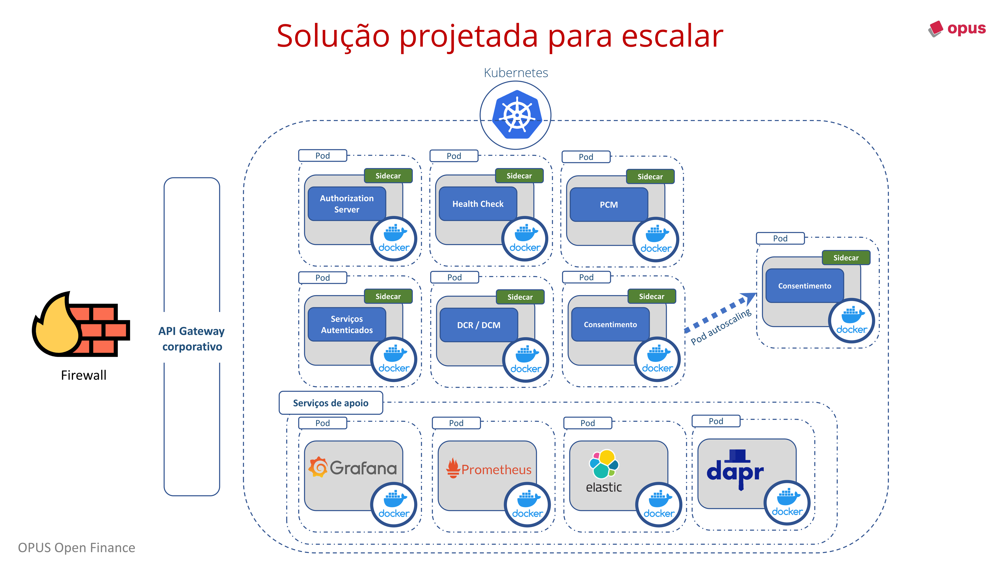

# Visão Geral da Arquitetura

A arquitetura da solução é baseada em **microsserviços**, projetada para suportar escalabilidade horizontal automática, e implementada em contêineres (**Docker**) rodando em um ambiente de execução clusterizado Kubernetes.

A plataforma é oferecida em três modalidades:

- Na nuvem do cliente, com ambiente administrado pelo time do cliente;
- Na nuvem do cliente, como uma subconta, com o ambiente sendo administrado pelo time da Opus Software;
- Em modelo de Software as a Service (SaaS)

A solução tem sido utilizada sucesso pelos clientes nos seguintes ambientes:

- **Ambientes Kubernetes como serviços gerenciados**:
  - Google GKE
  - AWS AKS
  - Azure EKS
- **Clusters Kubernetes on-premise gerenciados manualmente**

---

## Componentes e Ferramentas

Para sua execução a plataforma necessita dos seguintes componentes:

- Banco de dados *PostgreSQL* (tipicamente utilizado como serviço gerenciado)
- Fila de mensagens
  - Diferentes mecanismos de fila têm sido usados pelos nossos clientes, incluindo SQS/SNS, GCP Pub/Sub e Kafka;
  - A plataforma utiliza um componente de abstração que suporta os principais mecanismos de filas de mensagens do mercado.
- Sistema gerenciador de logs distribuidos
  - A solução padrão empacotada com a plataforma é o *Grafana Loki*, mas outras soluções têm sido usadas por nossos clientes como *Datadog* e *Elastic Stack*;

  A plataforma embute ainda um API Gateway que é empacotado junto com o produto e que pode funcionar atrás do produto padrão utilizado pelo cliente, se for o caso.

  A solução demanda também um *Web Application Firewall* (*WAF*) fornecido pelo cliente e que deve suportar o protocolo *Mutual TLS* (*mTLS*).

  Finalmente, em ambientes gerenciados pelo time da Opus utilizamos a combinação *Prometheus/Grafana* para visibilidade e monitoramento da solução em execução. Outras soluções como *Dynatrace* têm sido utilizadas com sucesso por nossos clientes.

---

## Escalabilidade horizontal

A arquitetura baseada em microsserviços adotada pela solução, executando em contêineres gerenciados pelo Kubernetes, é ideal para lidar com a demanda variável do ecossistema do Open Finance Brasil, pois permite escalabilidade horizontal de forma eficiente. Cada microsserviço pode ser dimensionado independentemente, garantindo que apenas os componentes necessários recebam mais recursos em momentos de alta demanda. O Kubernetes facilita esse processo ao monitorar automaticamente o uso de recursos e escalar instâncias de execução conforme necessário, mantendo a disponibilidade e o desempenho do sistema sem desperdício de recursos.

## Infraestrutura e configuração

- **Configuração de Autoscaling**:
  - Todos os módulos do sistema suportam autoscaling, permitindo ao Kubernetes ajustar o número de instâncias com base no uso de CPU e memória.

- **Distribuição e Gerenciamento**:
  - Utiliza **Helm charts** para:
    - Definição
    - Instalação
    - Upgrade da aplicação
    - Seleção de recursos para execução no cluster

- **Scripts Terraform**:
  - Disponibilizados para instalação e configuração dos componentes de infraestrutura.
