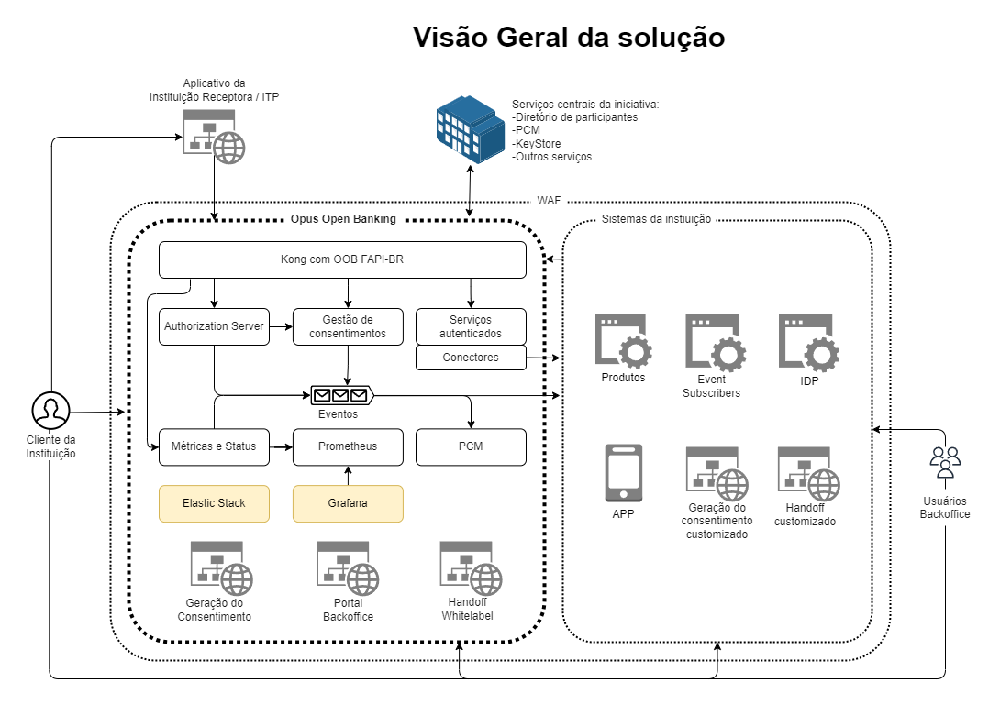

# Arquitetura do Produto

## Visão Geral da Arquitetura

A arquitetura da solução é baseada em **microsserviços**, projetada para suportar escalabilidade horizontal automática, e implementada em contêineres (**Docker**) rodando em um ambiente de execução clusterizado Kubernetes. A solução está atualmente em produção em:

- **Ambientes Kubernetes gerenciados**:
  - Google GKE
  - AWS AKS
  - Azure EKS
- **Clusters gerenciados manualmente**

---

### Componentes e Ferramentas

1. **Elastic Stack**:
   - Sugestão para gerenciamento de logs da solução.
   - Alternativas compatíveis: **Datadog**, **Loki**, ou qualquer ferramenta que integre ao cluster Kubernetes para ingestão de logs dos PODs.

2. **Grafana**:
   - Opção complementar para visibilidade da saúde da solução.
   - A saúde já é monitorada pelo microsserviço **"Métricas e Status"**, cobrindo todas as exigências regulatórias (APIs Admin e Comuns).

---

### Infraestrutura e Configuração

- A plataforma opera em uma estrutura de rede protegida por um **firewall** e requer um **API Gateway** para configuração adequada.
  - **Caso a instituição não possua um API Gateway corporativo**, ou prefira não disponibilizá-lo ao ambiente Open Finance:
    - O pacote de instalação inclui uma versão pré-configurada do **API Gateway Kong Community Edition**, sem custo adicional.
    - Garante execução autônoma e independente de soluções externas.

- **Configuração de Autoscaling**:
  - Todos os módulos do sistema suportam autoscaling, permitindo ao Kubernetes ajustar o número de instâncias com base no uso de CPU e memória.

- **Distribuição e Gerenciamento**:
  - Utiliza **Helm charts** para:
    - Definição
    - Instalação
    - Upgrade da aplicação
    - Seleção de recursos para execução no cluster

---

### Recursos Open Source e Scripts

- **Componentes Open Source** utilizados:
  - **Dapr**
  - **Grafana**
  - **Prometheus**

- **Scripts Terraform**:
  - Disponibilizados para instalação e configuração dos componentes de infraestrutura.

- **Gestão de Logs Distribuídos**:
  - O Elastic é incluído como padrão.
  - Pode ser substituído por outra solução, caso a instituição financeira já possua um padrão estabelecido.

